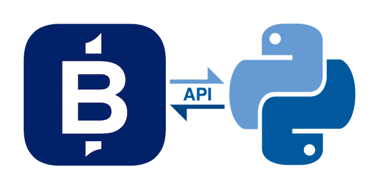

# Public API for Python

[](https://www.apache.org/licenses/LICENSE-2.0.html)
[](https://github.com/psf/black)
[](https://readthedocs.org/projects/bidfx-api-py)

-------

## Features

The BidFX Python API is a *pricing* and *trading* API that connects to
the BidFX platform to subscribe to realtime pricing and to place orders.
The API supports:

 - FX request for stream (RFS) pricing
 - FX request for quote (RFQ) pricing
 - FX and Futures trading with
    [REST](https://en.wikipedia.org/wiki/Representational_state_transfer) or 
    [WebSockets](https://en.wikipedia.org/wiki/WebSocket).

## Python Version

The API is compatible with Python 3.6 and greater.
If you do not have Python, please install the latest 3.x version from [python.org](https://python.org) 
or refer to the [Installing Python](http://docs.python-guide.org/en/latest/starting/installation/) section 
of the Hitchhiker’s Guide to Python.


## Quick start

### Installation

The API can be installed by running.

```sh
pip install bidfx-api-py
```

### API Docs

View the API documentation at [Read The Docs](https://bidfx-api-py.readthedocs.io).


## Alternative APIs

You can read about the complete BidFX API range, and their different capabilities,
at [BidFX API Overview](https://www.bidfx.com/apis).


## Development notes

API developers should read the [Developer Notes](DEVELOPMENT.md).
